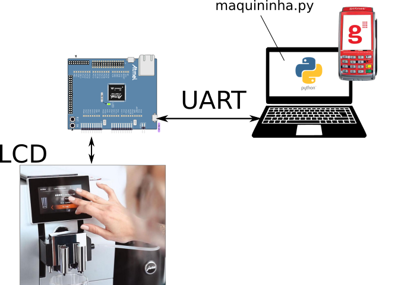

# 21a AV2 Estudo

Trabalhando com:

- RTOS
- LVGL
- UART (protocolo)

## Descrição

Neste simulado vocês terão que implementar uma interface para uma máquina de venda de café, o sistema deve se comunicar com uma maquininha de cartão de crédito simulada por um programa em python rodando no computador, a interface entre o uC e a "maquininha" é via comunicação serial. 

> O programa em python (maquininha.py) já foi implementando e não precisa mexer, só rodar.

Neste repositório fornecemos dois exemplos distintos:

- `demo-comunicacao`: firmware que implementa o protocolo de comunicação entre o uC e a maquininha.
- `demo-interface`: firmware que implementa a interface da máquina de café.

E um código em python:

- `maquininha.py`: Emulador da maquininha de cartão.

O protocolo de comunicação está especificado no arquivo [`PROTOCOLO.md`](PROTOCOLO.md), vocês vão precisar dele!

## Objetivo

Realizar a integração entre os dois firmwares (sugerimos `demo-comunicação` --> `demo-interface`). O sistema deve:

- [ ] Só possibilitar o usuário prosseguir para a tela 2 (seleção de açucar `lv_page_2_configurando()`) após a comunicação com a maquininha ter sido validada (uC envia `Verifica conexão` e maqininha responde com `OK`).

- [ ] Envia valor para cobrança (`Cobra valor`) assim que usuário fizer a confirmação do pedido na tela de `configuração do açucar`.

- [ ] Fica travado na tela `Aguardando pagamento` enquanto não tiver uma resposta de: `OK`, `Falhou` ou `Cancelado`

- [ ] Crie uma tela que moste que a compra foi cancelada, se receber uma informação de cancelada da comunicação com a maquininha.

- [ ] Troque os três semáforos dos botões (xSemaphoreOk, xSemaphorePago) por uma única fila.

- [ ] Adicionar botão de cancelar na tela de `Configuração Açucar`

- [ ] Adicionar timeour na tela `Configuração Açucar` (se usuário não digitar nada por 10s volta para tela inical)

- [ ] Adicionar indicação na `tela inicial` de que comunicação com maquinha está ativa, usar LED do LVGL.

- [ ] Adicionar alguma animação na tela `Peparando Café`

## Dicas

Começe executando o projeto `demo-comunicacao` junto com o python `maquininha.py`, valide a comunicação e entenda o que está acontecendo (note que a confirmação do pagamento é feito pelo terminal no python).

Depois execute o projeto `demo-interface`, entenda como fazemos uso do `pages` para criar várias telas, importante notar o funcionamento da máquina de estados (implementando com `switch case`) da `task_main`, ali é que temos o controle de tudo.

Execute a integração dos dois projetos, lembre, você deve validar o que está recebendo da comunicação com a maquininha.
